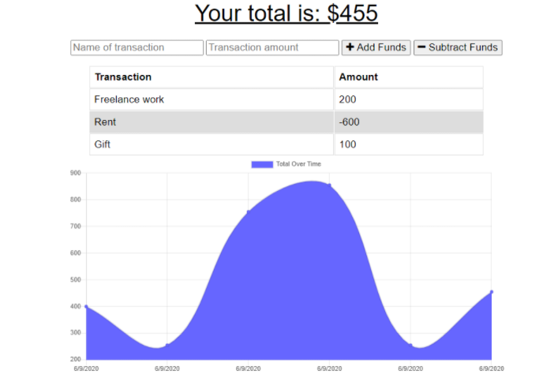

# Budget Tracking Application

## Description
* This is a progressive web application that utilizes service workers, IndexedDB, web manifest, and MongoDB. This application can be used by a user to track budget. The application will perform offline and update the server as soon as it is brought back online.

## Table of Contents
* [Installation](#installation)

* [Usage](#usage)

* [Contributors](#contributors)

* [License](#license)

* [Badges](#badges)

## Installation
* To use this application, you must clone the repo and install the dependencies using npm install. From here, you can initialize the server.

## Usage
* The server can be invoked using npm start. From here, the practitioner will be enabled add to their budget and provide a description of what the budget entails.

## Contributors
* Jay Beach
* University of Arizona

## License
* This application is covered under GPL v2.

## Badges

* 
* 
* 
* 